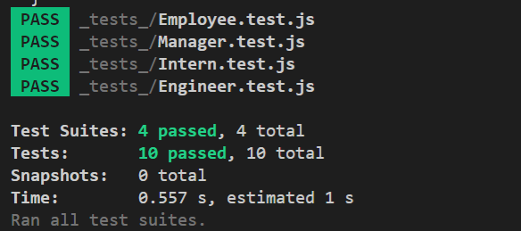
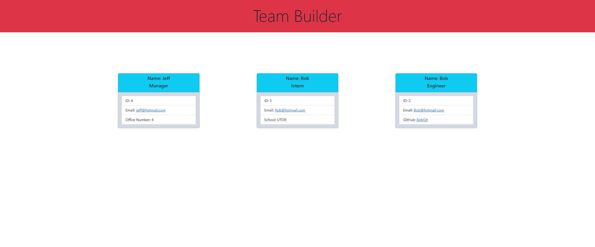

# 10 Object-Oriented Programming: Team Profile Generator

## Description

For this module we had to build a Node.js command-line application that takes in information about employees on a software engineering team, then generates an HTML webpage that displays summaries for each person. we also were tasked with writeing unit tests for every part of our code to ensure that it passes each test.
## Table of Contents:
- [Installation](#installation)
- [Usage](#usage)
- [Testing](#testing)
- [Mockup](#mockup)
- [Video](#video)
- [Credits](#credits)


## Installation

The applications dependancys will be installed by using the following command:

```bash
nmp i
```

## Usage

The applications dependancys will be installed by using the following command:
```bash
node index.js
```

## Testing

```bash
nmp test
```

## Mockup

---


## Video
[YouTube Video Link](https://youtu.be/SdGDtZ0DxCg)

## Credits
Software Designer: Dylan Knight

